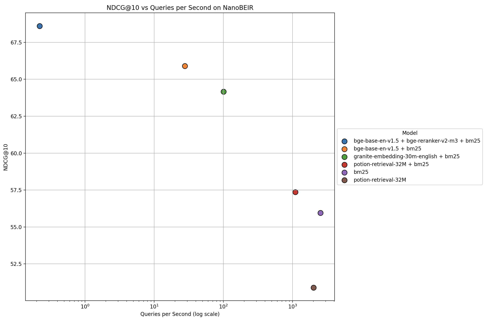

# Benchmarks

The benchmarks in this directory evaluate the performance and throughput of different encoder and reranker models for dense,  sparse, and hybrid vector search. The benchmarks are all run on the [NanoBEIR datasets](https://huggingface.co/collections/zeta-alpha-ai/nanobeir-66e1a0af21dfd93e620cd9f6b1b3b3b3) Throughput is measured on a part of the [wikitext dataset](https://huggingface.co/datasets/Salesforce/wikitext). The benchmarks are run with the following setup:
- Throughput benchmarks are all run on CPU
- The K value for the reranker is set to 30
- The alpha value for hybrid search is set to 0.5
- For the rerankers, the max input length is set to 512
- For throughput benchmarks, the number of queries is set to 100 and the number of documents is set to 10000

For the encoders, the following models were benchmarked:
- [minishlab/potion-retrieval-32M](https://huggingface.co/minishlab/potion-retrieval-32M)
- [sentence-transformers/all-MiniLM-L6-v2](https://huggingface.co/sentence-transformers/all-MiniLM-L6-v2)
- [ibm-granite/granite-embedding-30m-english](https://huggingface.co/ibm-granite/granite-embedding-30m-english)
- [BAAI/bge-base-en-v1.5](https://huggingface.co/BAAI/bge-base-en-v1.5)
- [BAAI/bge-small-en-v1.5](https://huggingface.co/BAAI/bge-small-en-v1.5)

For the rerankers, the following models were benchmarked:
- [BAAI/bge-reranker-v2-m3](https://huggingface.co/BAAI/bge-reranker-v2-m3)
- [cross-encoder/ms-marco-MiniLM-L6-v2](https://huggingface.co/cross-encoder/ms-marco-MiniLM-L6-v2)

Both [BAAI/bge-base-en-v1.5](https://huggingface.co/BAAI/bge-base-en-v1.5) and [BAAI/bge-small-en-v1.5](https://huggingface.co/BAAI/bge-small-en-v1.5) are benchmarked without a query instruction, and with a query instruction (`Represent this sentence for searching relevant passages:`).

## Main Results

The following table contains the main benchmark results. This is a subset of the full results which gives a good overview of the best models in terms of NDCG@10 vs QPS. The results are sorted by NDCG@10.


| Encoder Model | Reranker Model | BM25 | Instruction | NDCG@10 | MAP@10 | Recall@10 | Precision@10 | QPS |
| --- | --- | --- | --- | --- | --- | --- | --- | --- |
| BAAI/bge-base-en-v1.5 | BAAI/bge-reranker-v2-m3 | True | False | 68.61 | 57.10 | 68.45 | 20.67 | 0.22 |
| BAAI/bge-base-en-v1.5 | None | True | True | 65.90 | 53.51 | 67.49 | 20.78 | 27.64 |
| ibm-granite/granite-embedding-30m-english | None | True | False | 64.16 | 51.73 | 66.89 | 20.32 | 100.19 |
| minishlab/potion-retrieval-32M | None | True | False | 57.37 | 44.50 | 61.21 | 19.31 | 1094.16 |
| None | None | True | False | 55.96 | 43.40 | 59.42 | 18.90 | 2531.43 |
| minishlab/potion-retrieval-32M | None | False | False | 50.90 | 38.44 | 56.57 | 17.09 | 2012.31 |


|  |
|:--:|
|*Figure: The average NanoBEIR NDCG plotted against queries per second (log scale).*|


## Full Results

The following table contains the full benchmark results. Based on the full results, we draw the following conclusions:
- Hybrid search always outperforms dense search.
- Reranking always improves the performance.
- When using a reranker, the bottleneck for throughput becomes the reranker, not the encoder. This means that a combination of a fast encoder and reranker does not necessarily result in a higher throughput than a slower encoder and reranker.
- There is little to no effect on performance when adding a query instruction to the encoder in a hybrid retrieval or reranking setup.

| Encoder Model | Reranker Model | BM25 | Instruction | NDCG@10 | MAP@10 | Recall@10 | Precision@10 | QPS |
| --- | --- | --- | --- | --- | --- | --- | --- | --- |
| BAAI/bge-base-en-v1.5 | BAAI/bge-reranker-v2-m3 | True | False | 68.61 | 57.10 | 68.45 | 20.67 | 0.22 |
| BAAI/bge-base-en-v1.5 | BAAI/bge-reranker-v2-m3 | True | True | 68.51 | 56.99 | 68.44 | 20.75 | 0.21 |
| BAAI/bge-small-en-v1.5 | BAAI/bge-reranker-v2-m3 | True | True | 68.49 | 57.10 | 68.16 | 20.50 | 0.22 |
| sentence-transformers/all-MiniLM-L6-v2 | BAAI/bge-reranker-v2-m3 | True | False | 68.36 | 56.77 | 68.31 | 20.69 | 0.18 |
| BAAI/bge-small-en-v1.5 | BAAI/bge-reranker-v2-m3 | True | False | 68.28 | 56.89 | 68.02 | 20.45 | 0.23 |
| BAAI/bge-base-en-v1.5 | BAAI/bge-reranker-v2-m3 | False | False | 67.96 | 56.55 | 67.93 | 20.36 | 0.26 |
| ibm-granite/granite-embedding-30m-english | BAAI/bge-reranker-v2-m3 | True | False | 67.94 | 56.49 | 67.80 | 20.31 | 0.17 |
| BAAI/bge-base-en-v1.5 | BAAI/bge-reranker-v2-m3 | False | True | 67.92 | 56.40 | 67.61 | 20.48 | 0.23 |
| minishlab/potion-retrieval-32M | BAAI/bge-reranker-v2-m3 | True | False | 67.89 | 56.62 | 67.32 | 20.27 | 0.18 |
| BAAI/bge-small-en-v1.5 | BAAI/bge-reranker-v2-m3 | False | True | 67.33 | 56.24 | 67.31 | 19.92 | 0.25 |
| ibm-granite/granite-embedding-30m-english | BAAI/bge-reranker-v2-m3 | False | False | 67.30 | 56.05 | 67.72 | 19.82 | 0.22 |
| BAAI/bge-small-en-v1.5 | BAAI/bge-reranker-v2-m3 | False | False | 66.69 | 55.58 | 66.45 | 19.76 | 0.28 |
| minishlab/potion-retrieval-32M | BAAI/bge-reranker-v2-m3 | False | False | 66.27 | 55.28 | 64.72 | 19.72 | 0.23 |
| sentence-transformers/all-MiniLM-L6-v2 | BAAI/bge-reranker-v2-m3 | False | False | 66.26 | 54.93 | 65.72 | 19.62 | 0.21 |
| BAAI/bge-base-en-v1.5 | None | True | True | 65.90 | 53.51 | 67.49 | 20.78 | 27.64 |
| None | BAAI/bge-reranker-v2-m3 | True | False | 65.88 | 55.04 | 64.09 | 19.58 | 0.18 |
| BAAI/bge-base-en-v1.5 | None | True | False | 65.79 | 53.35 | 67.69 | 20.74 | 27.91 |
| BAAI/bge-small-en-v1.5 | None | True | False | 64.79 | 52.54 | 66.28 | 20.35 | 51.58 |
| BAAI/bge-small-en-v1.5 | None | True | True | 64.75 | 52.28 | 66.72 | 20.61 | 58.07 |
| BAAI/bge-base-en-v1.5 | None | False | True | 64.17 | 52.54 | 66.35 | 19.49 | 26.08 |
| ibm-granite/granite-embedding-30m-english | None | True | False | 64.16 | 51.73 | 66.89 | 20.32 | 100.19 |
| BAAI/bge-base-en-v1.5 | None | False | False | 63.69 | 52.02 | 66.42 | 19.22 | 27.04 |
| BAAI/bge-base-en-v1.5 | cross-encoder/ms-marco-MiniLM-L6-v2 | True | True | 63.61 | 51.17 | 65.74 | 20.27 | 3.19 |
| BAAI/bge-base-en-v1.5 | cross-encoder/ms-marco-MiniLM-L6-v2 | True | False | 63.34 | 50.99 | 65.33 | 20.00 | 3.17 |
| BAAI/bge-base-en-v1.5 | cross-encoder/ms-marco-MiniLM-L6-v2 | False | False | 63.34 | 51.05 | 65.36 | 19.94 | 3.57 |
| sentence-transformers/all-MiniLM-L6-v2 | cross-encoder/ms-marco-MiniLM-L6-v2 | True | False | 63.33 | 50.91 | 65.68 | 20.07 | 3.50 |
| BAAI/bge-base-en-v1.5 | cross-encoder/ms-marco-MiniLM-L6-v2 | False | True | 63.25 | 50.85 | 64.91 | 19.94 | 3.47 |
| BAAI/bge-small-en-v1.5 | cross-encoder/ms-marco-MiniLM-L6-v2 | True | True | 63.15 | 50.92 | 64.97 | 20.00 | 3.50 |
| BAAI/bge-small-en-v1.5 | cross-encoder/ms-marco-MiniLM-L6-v2 | True | False | 63.08 | 50.87 | 64.82 | 19.90 | 3.32 |
| BAAI/bge-small-en-v1.5 | None | False | True | 63.06 | 51.44 | 64.55 | 19.22 | 56.70 |
| ibm-granite/granite-embedding-30m-english | cross-encoder/ms-marco-MiniLM-L6-v2 | True | False | 63.06 | 50.75 | 65.28 | 19.90 | 3.46 |
| minishlab/potion-retrieval-32M | cross-encoder/ms-marco-MiniLM-L6-v2 | True | False | 62.96 | 50.64 | 64.93 | 19.84 | 3.98 |
| BAAI/bge-small-en-v1.5 | cross-encoder/ms-marco-MiniLM-L6-v2 | False | True | 62.74 | 50.74 | 64.52 | 19.62 | 3.62 |
| BAAI/bge-small-en-v1.5 | cross-encoder/ms-marco-MiniLM-L6-v2 | False | False | 62.56 | 50.49 | 64.27 | 19.62 | 4.17 |
| ibm-granite/granite-embedding-30m-english | cross-encoder/ms-marco-MiniLM-L6-v2 | False | False | 62.44 | 50.43 | 64.12 | 19.18 | 3.84 |
| sentence-transformers/all-MiniLM-L6-v2 | None | True | False | 62.28 | 49.77 | 65.00 | 20.01 | 103.95 |
| sentence-transformers/all-MiniLM-L6-v2 | cross-encoder/ms-marco-MiniLM-L6-v2 | False | False | 61.58 | 49.47 | 63.46 | 19.19 | 4.04 |
| minishlab/potion-retrieval-32M | cross-encoder/ms-marco-MiniLM-L6-v2 | False | False | 61.55 | 49.77 | 62.79 | 18.99 | 4.72 |
| BAAI/bge-small-en-v1.5 | None | False | False | 61.25 | 49.86 | 62.78 | 18.64 | 51.55 |
| None | cross-encoder/ms-marco-MiniLM-L6-v2 | True | False | 61.20 | 49.26 | 62.17 | 19.30 | 3.66 |
| ibm-granite/granite-embedding-30m-english | None | False | False | 60.47 | 49.33 | 63.21 | 17.63 | 96.94 |
| minishlab/potion-retrieval-32M | None | True | False | 57.37 | 44.50 | 61.21 | 19.31 | 1094.16 |
| sentence-transformers/all-MiniLM-L6-v2 | None | False | False | 56.55 | 44.55 | 61.09 | 17.70 | 100.73 |
| None | None | True | False | 55.96 | 43.40 | 59.42 | 18.90 | 2531.43 |
| minishlab/potion-retrieval-32M | None | False | False | 50.90 | 38.44 | 56.57 | 17.09 | 2012.31 |


## Reproducibility

To reproduce the results, run the `benchmark_performance` and `benchmark_throughput` scripts with the config you want to reproduce. For example, to reproduce the results for the `minishlab/potion-retrieval-32M` encoder with the `cross-encoder/ms-marco-MiniLM-L6-v2` reranker and BM25 enabled, run the following commands:

```bash
python -m benchmarks.benchmark_performance --encoder-model "minishlab/potion-retrieval-32M" --bm25 --reranker-model "cross-encoder/ms-marco-MiniLM-L6-v2" --save-path "./results"
```

```bash
python -m benchmarks.benchmark_throughput --encoder-model "minishlab/potion-retrieval-32M" --bm25 --reranker-model "cross-encoder/ms-marco-MiniLM-L6-v2" --save-path "./results" --device "cpu" --max-documents 10000 --num-queries 100
```

Then, the results table can be printed by running the following command:

```bash
python -m benchmarks.print_benchmarks_table --results-path "./results"
```
